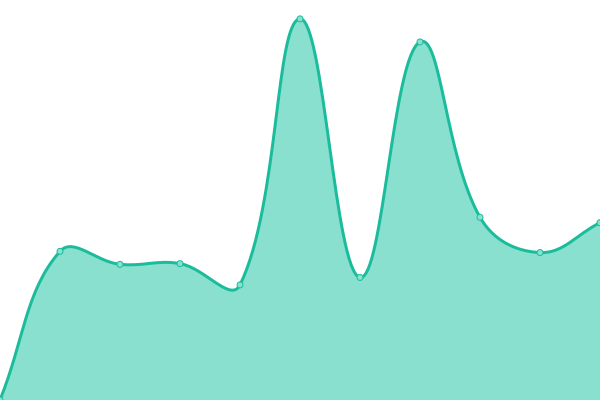

# [📈 Live Status](https://hoopybe.github.io/uptime): <!--live status--> **🟧 Partial outage**

<!--start: status pages-->
<!-- This summary is generated by Upptime (https://github.com/upptime/upptime) -->
<!-- Do not edit this manually, your changes will be overwritten -->
<!-- prettier-ignore -->
| URL | Status | History | Response Time | Uptime |
| --- | ------ | ------- | ------------- | ------ |
|  [Hoopy.be](https://hoopy.be) | 🟩 Up | [hoopy-be.yml](https://github.com/hoopybe/uptime/commits/HEAD/history/hoopy-be.yml) | 

 888ms
     
 | 

<a href="https://hoopybe.github.io/uptime/history/hoopy-be">100.00%</a>
    

|  [Support.hoopy.be](https://support.hoopy.be) | 🟩 Up | [support-hoopy-be.yml](https://github.com/hoopybe/uptime/commits/HEAD/history/support-hoopy-be.yml) | 

 1912ms
     
 | 

<a href="https://hoopybe.github.io/uptime/history/support-hoopy-be">99.57%</a>
    

|  [Google 204](https://google.com/generate_204) | 🟩 Up | [google-204.yml](https://github.com/hoopybe/uptime/commits/HEAD/history/google-204.yml) | 

 60ms
     
 | 

<a href="https://hoopybe.github.io/uptime/history/google-204">100.00%</a>
    

|  FW | 🟥 Down | [fw.yml](https://github.com/hoopybe/uptime/commits/HEAD/history/fw.yml) | 

 2320ms
     
 | 

<a href="https://hoopybe.github.io/uptime/history/fw">99.38%</a>
    

|  FWAw | 🟩 Up | [fw-aw.yml](https://github.com/hoopybe/uptime/commits/HEAD/history/fw-aw.yml) | 

 1591ms
     
 | 

<a href="https://hoopybe.github.io/uptime/history/fw-aw">100.00%</a>
    

|  FWM | 🟥 Down | [fwm.yml](https://github.com/hoopybe/uptime/commits/HEAD/history/fwm.yml) | 

 2931ms
     
 | 

<a href="https://hoopybe.github.io/uptime/history/fwm">14.92%</a>
    

|  F2000 | 🟥 Down | [f2000.yml](https://github.com/hoopybe/uptime/commits/HEAD/history/f2000.yml) | 

 0ms
     
 | 

<a href="https://hoopybe.github.io/uptime/history/f2000">0.00%</a>
    

|  FWAll | 🟥 Down | [fw-all.yml](https://github.com/hoopybe/uptime/commits/HEAD/history/fw-all.yml) | 

 1234ms
     
 | 

<a href="https://hoopybe.github.io/uptime/history/fw-all">14.92%</a>
    

|  FWB | 🟥 Down | [fwb.yml](https://github.com/hoopybe/uptime/commits/HEAD/history/fwb.yml) | 

 1075ms
     
 | 

<a href="https://hoopybe.github.io/uptime/history/fwb">14.92%</a>
    

|  CMG | 🟩 Up | [cmg.yml](https://github.com/hoopybe/uptime/commits/HEAD/history/cmg.yml) | 

 1631ms
     
 | 

<a href="https://hoopybe.github.io/uptime/history/cmg">100.00%</a>
    

|  EMYG | 🟩 Up | [emyg.yml](https://github.com/hoopybe/uptime/commits/HEAD/history/emyg.yml) | 

 910ms
     
 | 

<a href="https://hoopybe.github.io/uptime/history/emyg">100.00%</a>
    

|  PSI | 🟩 Up | [psi.yml](https://github.com/hoopybe/uptime/commits/HEAD/history/psi.yml) | 

 926ms
     
 | 

<a href="https://hoopybe.github.io/uptime/history/psi">100.00%</a>
    

|  LDP | 🟥 Down | [ldp.yml](https://github.com/hoopybe/uptime/commits/HEAD/history/ldp.yml) | 

 0ms
     
 | 

<a href="https://hoopybe.github.io/uptime/history/ldp">0.00%</a>
    

|  GBZ | 🟩 Up | [gbz.yml](https://github.com/hoopybe/uptime/commits/HEAD/history/gbz.yml) | 

 2847ms
     
 | 

<a href="https://hoopybe.github.io/uptime/history/gbz">100.00%</a>
    

|  BA | 🟩 Up | [ba.yml](https://github.com/hoopybe/uptime/commits/HEAD/history/ba.yml) | 

 2261ms
     
 | 

<a href="https://hoopybe.github.io/uptime/history/ba">92.35%</a>
    

|  TPB | 🟩 Up | [tpb.yml](https://github.com/hoopybe/uptime/commits/HEAD/history/tpb.yml) | 

 1499ms
     
 | 

<a href="https://hoopybe.github.io/uptime/history/tpb">90.69%</a>
    

|  BDH | 🟩 Up | [bdh.yml](https://github.com/hoopybe/uptime/commits/HEAD/history/bdh.yml) | 

 851ms
     
 | 

<a href="https://hoopybe.github.io/uptime/history/bdh">92.41%</a>
    

|  BIBRU | 🟩 Up | [bibru.yml](https://github.com/hoopybe/uptime/commits/HEAD/history/bibru.yml) | 

 1189ms
     
 | 

<a href="https://hoopybe.github.io/uptime/history/bibru">100.00%</a>
    

<!--end: status pages-->

## 📄 License

- Powered by: [Upptime](https://github.com/upptime/upptime)
- Code: [MIT](./LICENSE) © [Upptime](https://upptime.js.org)
- Data in the `./history` directory: [Open Database License](https://opendatacommons.org/licenses/odbl/1-0/)
